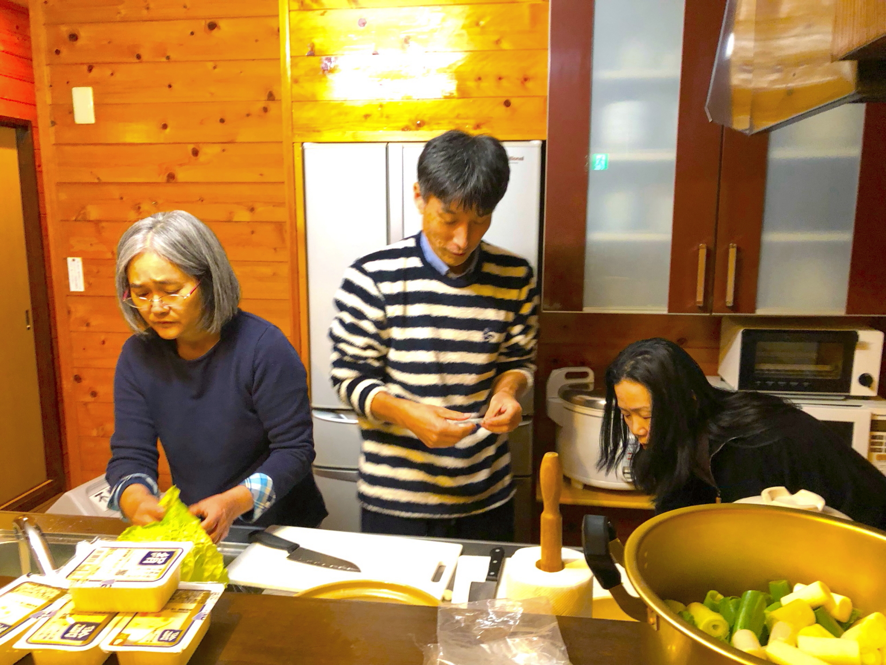
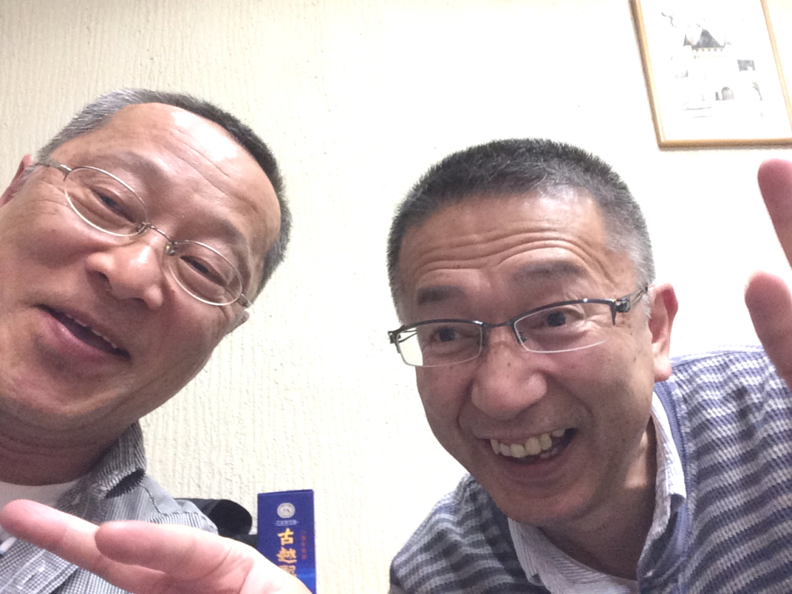

# Empty-s
<html lang="ja">
 <head>
  <meta charset="utf-8" />
 

<link href="https://cdnjs.cloudflare.com/ajax/libs/lightbox2/2.7.1/css/lightbox.css" rel="stylesheet">
   
</head>

  モバイル端末をお使いの場合は、画面を横向きにするとより見やすくご覧頂けます。

<body onload="alert('エンプティーズ と レプレッションズ、忘年会の記録へようこそ！')" onunload="alert('再会の時まで、元気でお過ごしくださいませ。またやりましょう〜(^o^)/')">
<h1><marquee behavior="alternate">!!! Empty's & Lepression's !!!</marquee></h1>

2018、河口湖忘年会

                              

 アクセス用QRコード

<marquee direction="right" scrollamount="20" width="30%">(^_^)/~hada</marquee>

<h2><marquee behavior="alternate">!!! 2019年12月7日、軽井沢 !!!</marquee></h2>

<section><h4>2019年進捗 今年も股さんに予約してもらいました。 
	部屋はコネクション館のメゾネットタイプを予約！ 
	<a href="https://www.hgp.co.jp/inf/Z10/hgp/facilities.html" target="_blank">グリーンプラザホテル軽井沢HPリンク</a>
	 
	  当日の観光ポイントをメモしておきます。 
今回は碓氷峠のメガネ橋を散策したいと思っていますがどうですか？・・・by股さん＠LINE連絡網 
<a href="http://www.annaka-city.com/history/01.htm" target="_blank">めがね橋、観光案内リンク</a>
	 </h4></section>

Map

<iframe src="https://www.google.com/maps/embed?pb=!1m18!1m12!1m3!1d358549.04223923176!2d138.43945655381694!3d36.49051996032853!2m3!1f0!2f0!3f0!3m2!1i1024!2i768!4f13.1!3m3!1m2!1s0x0%3A0x5c85c473b82a0465!2sHotel+Green+Plaza+Karuizawa!5e0!3m2!1sen!2sjp!4v1563186883776!5m2!1sen!2sjp" width="600" height="450" frameborder="0" style="border:0" allowfullscreen></iframe>

  
     

<h2><marquee behavior="alternate">!!! 2018年12月8日、河口湖 !!!</marquee></h2>

<section><h6> 当日の集合場所と時間をメモしておきます。・・・by股さん＠LINE連絡網  
	ランチの予約しました。 車は店の反対側の閉店中の田村亭の駐車場に停めて下さい、との事です。 １２時にここに集合です。  
パルコ デル チェロ 
0555-62-0603 
山梨県南都留郡山中湖村平野2468-1   
<a href="https://tabelog.com/yamanashi/A1903/A190302/19000519/" target="_blank">パルコ　デル　チェロ　HPリンク</a>
サラダ、パスタ、ピザなどで税込2,000円で２１人なので貸切です。 コーヒーを付けると＋300円です。
	  
車の台数は以下の10台 
	股さん、稲垣、麿、ノブ、吉野、キミ、一郎、貴志、羽田、ハバさん（バイク） 
	</h6></section>

  

<h3>↓ 画像はクリックで拡大、スライドショー表示します。</h3>

<h3>↓ ここからLINE共有画像。</h3>

  
     

<h2><marquee behavior="alternate">!!! 2017年12月2日、河口湖 !!!</marquee></h2>

<h3>↓ 画像はクリックで拡大、スライドショー表示します。</h3>

	

  
     

<h2><marquee behavior="alternate">!!! 2016年12月3日、河口湖 !!!</marquee></h2>

<h3>↓ 画像はクリックで拡大、スライドショー表示します。</h3>

	

  
     

<h2><marquee behavior="alternate">!!! 2015年11月28日、箱根  !!!</marquee></h2>

<h3>↓ 画像はクリックで拡大、スライドショー表示します。動画は別クリックしてくださいね～( ^^) _U~~ </h3>

  
     

<h2><marquee behavior="alternate">!!! 2013年11月30日、熱海 !!!</marquee></h2>

<h3>↓ 画像はクリックで拡大、スライドショー表示します。</h3>

  

     	
<h2>
 <a href="https://torokoid.github.io/seisan-3/" target="_blank">会計計算、名前と金額の入力で割り勘計算が出来ます！</a>
	</h2>

                    	

  

 

<!-- フッタ -->
 <footer>
 Copyright 2018/07/21 S.Hada
 </footer>
